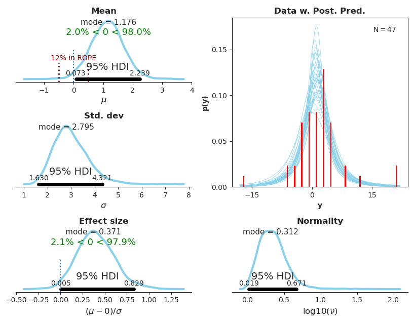

# Bayesian estimation for a single group

This Python package implements the software described in

> Kruschke, John. (2012) Bayesian estimation supersedes the t
> test. Journal of Experimental Psychology: General.

It implements Bayesian estimation for a single group, providing complete
distributions for effect size, group means,
standard deviations and the normality of the
data. As well as the visualization of posterior distribution curves and a quality of fit. See John Kruschke's [website on
BEST](http://www.indiana.edu/~kruschke/BEST/) for more information.

## Requirements ##

 * tested with Python 3.6
 * [PyMC3](https://docs.pymc.io/) for MCMC sampling
 * [matplotlib](http://matplotlib.org) and [seaborn](https://seaborn.pydata.org/) for plotting

## Example ##

Here is the plot created by `examples/smart_drug.py`:

